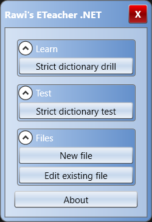
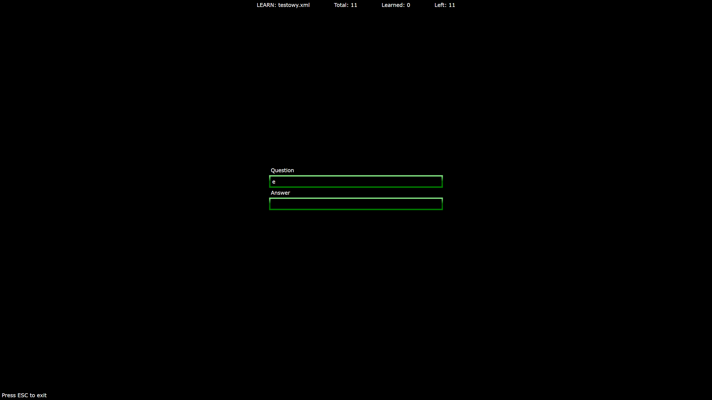
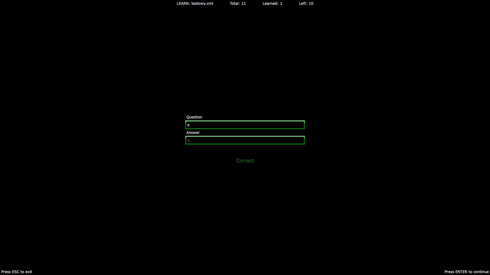
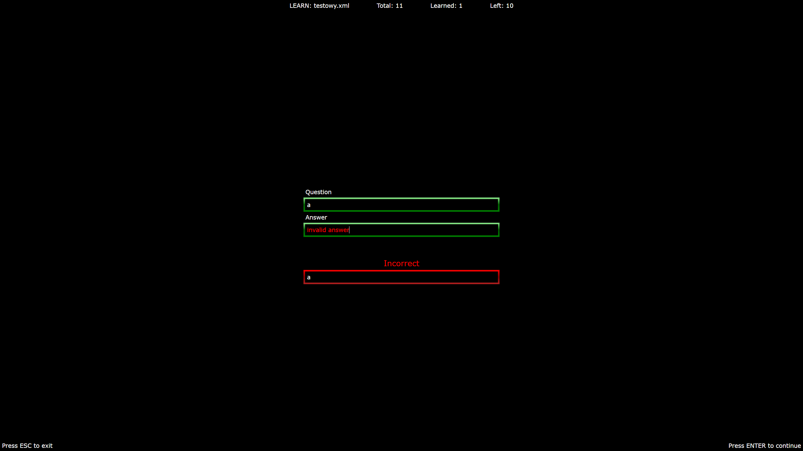
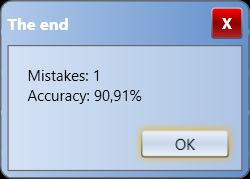

## Application for Learning Foreign Languages
Application should start with basic main menu with two buttons
- Strict dictionary drill
- Strict dictionary test
Example mockup is in file main-menu.png
The application should start with a basic main menu featuring two buttons:
- **Strict Dictionary Drill**
- **Strict Dictionary Test**

Example mockup:

The application should load example input JSON files such as [`sample-input.json`](sample-input.json). The file contains a list of question-answer items. The goal is to present each question, wait for user input, and then compare it with the expected answer. The user is notified whether the answer was correct.
## Strict Dictionary Drill

There should be a window that loads a sample JSON file and displays the following:
- **Mode:** LEARN
- **File name**
- **Total:** Total number of questions to be asked
- **Learned:** Number of correctly answered values
- **Left:** Number of questions left to be asked
- **Info:** "Press ESC to exit"
- **Textbox "Question":** Read-only
- **Textbox "Answer":** User enters the answer here
Questions are asked in random order. If the user answers a question correctly, it will not be asked again in the session. Incorrectly answered questions will be repeated until answered correctly.
When user is required to provide the answer the focus should be on the input control. Enter key should always submit the answer.

## Strict Dictionary Test

This mode looks the same as **Strict Dictionary Drill** with the following differences:
- **Mode:** TEST (instead of LEARN)
- **Answered:** Counter for correctly answered questions (replaces "Learned")
Questions are asked in random order. Each question is asked exactly once.

## Mockups

Relevant mockups for **Strict Dictionary Drill** and **Strict Dictionary Test**:

## Result

After **Strict Dictionary Drill** or **Strict Dictionary Test** ends, a summary window is displayed with user statistics for the session.
Example mockup:

# Application for learning foreign languages #
Application should start with basic main menu with two buttons
- Strict dictionary drill
- Strict dictionary test
Example mockup is in file main-menu.png

Application should load example input json files like sample-input.json. The file contains list of question-answer items. The goal is to present each question and wait for user input and then compare with expected answer. The user is notified whether or not the answer was correct or not.

## Strict dictionary drill ##
There should be a window that loads a sample json file and displays the following things:
- mode: LEARN
- file name
- total number of questions to be asked named "Total"
- number of learned words that is measured as number of correctly answered values named "Learned"
- number of questions left to be asked named "Left"
- Info "Press ESC to exit"
- Textbox with label "Question", it should be readonly
- Textbox with label "Answer", this is the place where user enters the answer

Questions are asked in random order.
If the user correctly answers the question then this question will not be asked again in this session. If the answer was not provided correctly then it will be asked again until the correct answer is provided but program should proceed to another question.
After providing each answer the user sees the feedback and needs to press ENTER to proceed to the next question or end of drill/test.

## Strict dictionary test ##
Looks the same as "Strict dictionary drill" with notable differences:
- mode: TEST (instead of LEARN)
- instead of "Learned" counter there is "Answered" counter which counts number of correctly answered questions

Questions are asked in random order. Each question is asked exactly once.

## Mockups ##
Example mockups that are relevant for "Strict dictionary drill" and "Strict dictionary test" are in files:
- drill-window.png
- drill-window-after-correct-answer.png
- drill-window-after-incorrect-answer.png

## Result ##
After "Strict dictionary drill" or "Strict dictionary test" ends there is a summary window displayed with user statistics within this session. Example mockup is in result-after-drill.png.
In this window there should be "Close" button and when I click it it should close the result window and the drill/test window so that I'm back at the main menu.